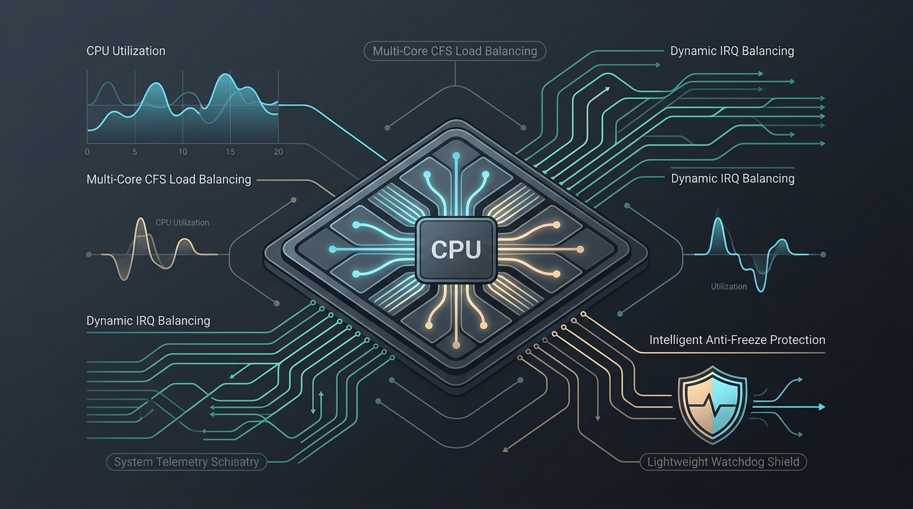
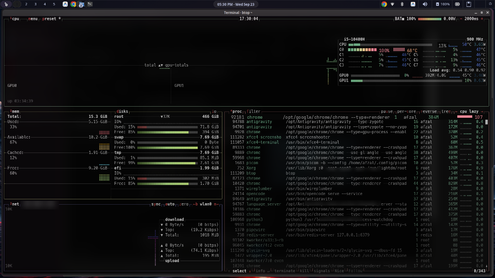

# Linux System Process Watchdog



A lightweight, intelligent background daemon that prevents Linux desktop freezes and system lockups caused by runaway CPU or RAM processes, without terminating productive applications.

> [!WARNING]
> **Please check the code before use in your computer.**
> Always review the source code, installation scripts, and configurations before running them with root privileges on your system.

---

## Why this exists: The Multi-Core False Positive Problem

On modern Linux developer machines running multiple Docker containers, code editors, background compilers, and dozens of browser tabs, rogue infinite loops or runaway threads can lock up the entire desktop interface.

Standard out-of-memory killers (like `earlyoom`) handle RAM exhaustion very well, but CPU thread deadlocks can still freeze mouse cursors, window compositors, and shell sessions.

### The Naive Watchdog Trap

Many naive watchdog scripts attempt to solve this by measuring per-process CPU percentage and killing anything that exceeds a fixed threshold (e.g. 90%). 

On modern multi-core systems, this causes **serious false positives**: a single Chrome WebAssembly thread, video decoding job, or Rust compilation peaking at 100% on one core represents only a fraction of total multi-core capacity (e.g. 12.5% on an 8-thread CPU). The system is not actually freezing, yet the naive watchdog kills the user's browser or IDE.



### Understanding the Problem from the Screenshot Above

Looking closely at the real-world `btop` system monitor capture above illustrates exactly why naive process killers fail:

1. **Single Core Maxed Out (`C0` at 100%)**:
   - In the CPU core monitor (top right), core **`C0`** is pegged at **100%** (indicated by the solid red bar).
2. **Overall System is Mostly Idle (`13%` Total CPU, Load Avg 0.54)**:
   - Despite core `C0` running at full speed, all other cores (**`C1` through `C7`**) are idling between **4% and 13%**.
   - Total machine CPU usage is only **13%**. The desktop window manager, compositor (`picom`), Xorg, and terminal shells have **87% available headroom** and are completely fluid and responsive.
3. **The "Offending" Process (`PID 92181: chrome --type=renderer` at 107%)**:
   - In the process list, a legitimate Google Chrome renderer thread is executing heavy client-side computation, registering at **107%** CPU (saturating 1 full logical core).
4. **What a Naive Watchdog Does (Destructive False Positive)**:
   - A naive script checking `if process_cpu > 90% then kill` sees Chrome at 107% and sends `SIGKILL`.
   - **Result:** The user's active browser tab crashes, losing unsaved web apps, forms, or documents—even though the computer was running smoothly without any freeze.
5. **How This Intelligent Watchdog Solves It**:
   - **Step 1 (Whole-System Check):** Evaluates aggregate CPU from `/proc/stat`. Since total system load is 13% (well below the 85% `TOTAL_SYS_CPU_THRESHOLD`), it takes **no destructive action**.
   - **Step 2 (Productivity Whitelist):** Even during genuine total system overload, `chrome` is protected by the built-in immunity whitelist and will never be killed.
   - **Step 3 (Gentle Priority Throttling):** If an *unknown* non-whitelisted runaway loop pegs cores during genuine system-wide distress, it first throttles its priority to `nice +19` at 30 seconds. This immediately yields CPU cycles back to the desktop UI without terminating the program or losing data.

---

## Key Features

- Whole-System Load Awareness: Evaluates true overall system CPU stress from `/proc/stat`. If the entire machine has adequate headroom (e.g. total CPU load is under 85%), individual heavy threads are left alone.
- Gentle Priority Throttling (Renice): When an unknown rogue process consumes excessive CPU during high system stress, the daemon first throttles its priority to `nice +19`. This immediately yields CPU cycles back to the desktop environment without terminating the process or causing data loss.
- Productivity Immunity Whitelist: Complete immunity for web browsers (Chrome, Chromium, Firefox, Brave, Zen), IDEs (VS Code, Antigravity IDE, Neovim), language runtimes (Node.js, Python, Flutter, Dart, Java, Rust), build tools, and desktop window managers. Whitelisting inspects both process names and full command-line invocations.
- Automatic Page Cache Trimming: Periodically checks memory cache usage and flushes clean page cache whenever cache exceeds 2.5 GB, keeping physical RAM available for active processes.
- Dynamic Desktop Notifications: Sends desktop warning notifications via `notify-send` to the active graphical user session.
- Zero External Dependencies: Written entirely in standard library Python 3 without requiring third-party pip packages.

---

## Quick Installation

Clone this repository and run the automated installer:

```bash
git clone https://github.com/<your-username>/system-process-watchdog.git
cd system-process-watchdog
chmod +x install.sh
sudo ./install.sh
```

The installer performs the following:
1. Copies `bin/system-process-watchdog` to `/usr/local/bin/system-process-watchdog`.
2. Installs the configuration file to `/etc/process-watchdog.conf`.
3. Installs and starts the `process-watchdog.service` systemd unit.

---

## Configuration

Configuration is managed via `/etc/process-watchdog.conf`:

```ini
# Total system CPU load threshold across all CPU threads (0.0% to 100.0%).
# The daemon will ONLY intervene if the entire system CPU load exceeds this threshold.
TOTAL_SYS_CPU_THRESHOLD=85.0

# Per-process CPU threshold (where 100% = 1 full core, max = num_cores * 100%).
# On an 8-thread system, 350% means the process is consuming 3.5 entire cores.
PROC_CPU_THRESHOLD=350.0

# Sustained seconds of high CPU under system stress before termination
CPU_MAX_SECONDS=60.0

# Seconds before sending a warning notification and applying priority throttling (nice +19)
CPU_WARN_SECONDS=30.0

# Physical RAM percentage threshold for a single rogue process
RAM_THRESHOLD=85.0

# Whitelist of immune processes (comma-separated).
# Any process matching these names or command lines will never be terminated.
WHITELIST=init,systemd,Xorg,xfwm4,xfce4-session,xfce4-panel,xfsettingsd,dbus-daemon,polkitd,pipewire,wireplumber,pulseaudio,systembus-notify,earlyoom,ananicy-cpp,irqbalance,sshd,antigravity,antigravity-ide,antigravity-agent,antigravity-cli,agy,agent,bash,fish,zsh,sh,xfce4-terminal,alacritty,kitty,btd,lightdm,picom,xcape,rofi,chrome,google-chrome,chromium,brave,firefox,zen,epiphany,code,Code,vscode,nvim,neovim,vim,nano,emacs,sublime_text,idea,clion,pycharm,webstorm,studio,flutter,dart,node,npm,npx,yarn,pnpm,java,javac,python,python3,rustc,cargo,gcc,g++,clang,clang++,cmake,ninja,make,git,docker,dockerd,containerd,electron
```

After modifying the configuration, restart the daemon:

```bash
sudo systemctl restart process-watchdog.service
```

---

## Service Management

Check service status:
```bash
sudo systemctl status process-watchdog.service
```

Follow live service logs:
```bash
sudo journalctl -u process-watchdog.service -f
```

View the detailed daemon activity log:
```bash
tail -f /var/log/process-watchdog.log
```

---

## How It Works

1. Sampling Interval: Every 5 seconds, the daemon samples aggregate ticks from `/proc/stat` and per-process ticks from `/proc/[pid]/stat`.
2. Whole-System Calculation: The daemon computes:
   `system_cpu_percent = ((total_delta - idle_delta) / total_delta) * 100.0`
3. Stress Verification: If `system_cpu_percent` is below `TOTAL_SYS_CPU_THRESHOLD` (85%), no action is taken.
4. Process Evaluation: If the system is under stress, the daemon identifies non-whitelisted processes consuming more than `PROC_CPU_THRESHOLD`.
5. Graduated Mitigation:
   - At 30 seconds: The process priority is reduced to `nice +19` using `os.setpriority`, and a desktop notification is dispatched. This immediately yields CPU bandwidth back to the desktop UI.
   - At 60 seconds: If the process continues to saturate the CPU and the whole system remains under severe stress, `SIGTERM` is sent, followed by `SIGKILL` if unresponsive.

---

## Uninstallation

To remove the daemon and service:

```bash
cd system-process-watchdog
chmod +x uninstall.sh
sudo ./uninstall.sh
```

---

## License

This project is licensed under the MIT License. See the [LICENSE](LICENSE) file for details.
